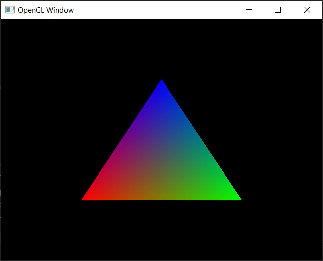

# OpenGL Window - Windows Port
Port of the OpenGL window on Windows. There is a setup guide to setup OpenGL with Visual Studio 2022 on Windows.



## 1. Download the GLFW and GLEW Development Libaries
1. Go to this page to download the lastest GLFW and GLEW VC++ development libaries:
    - https://www.glfw.org/download
    - https://glew.sourceforge.net/

2. Download these files (**glew-2.1.0-win32.zip**, **glfw-3.4.bin.WIN64.zip**)

2. Extract the zip files (**glew-2.1.0-win32.zip**, **glfw-3.4.bin.WIN64.zip**)

3. Create a folder called `vclib` at C drive (`C:\vclib`).

4. Copy the folders (`glew-2.1.0`, `glfw-3.4.bin.WIN64`) to `C:\vclib`
    - GLEW Folder: `glew-2.1.0-win32\glew-2.1.0`
    - GLFW Folder: `glfw-3.4.bin.WIN64\glfw-3.4.bin.WIN64`

## 2. Configure the Project in Visual Studio 

1. Make sure your default build setting is `Debug` `x64`.

2. Go to *Project Properties* -> *Configuration Properties* -> Linker -> Input 

**Additional Dependencies** -> Edit:
```
glfw3.lib
glfw3_mt.lib
glfw3dll.lib
glew32.lib
glew32s.lib
opengl32.lib
```

3. Go to *Project Properties* -> *Go to Configuration Properties* -> *VC++ Directories*

**Include Directories** -> Edit:
```
C:\vclib\glew-2.1.0\include
C:\vclib\glfw-3.4.bin.WIN64\include
```

**Library Directories** -> Edit:
```
C:\vclib\glew-2.1.0\lib\Release\x64
C:\vclib\glfw-3.4.bin.WIN64\lib-vc2022
```

## 3. Setup Environmental Variables for GLFW and GLEW
1. Go to Settings -> Search and click *Edit the system environment variables* -> Click *Environment Variables*

2. Edit the **Path** under the *System varables*:
```
C:\vclib\glfw-3.4.bin.WIN64\lib-vc2022
C:\vclib\glew-2.1.0\bin\Release\x64
```

**Note**: to add multiple paths add a semicolon after each path

## 4. Build the Program
1. Restart Visual Studio so Visual C++ can get the updated path variable
2. Build and run your program and it should work.

